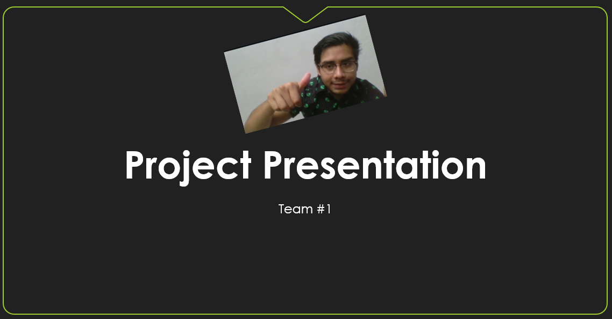

# Human Computer Interaction project repository

## 📝 About the project

Description...

> [📚 Go to the documentation section.](./github/doc/index.md)

## 👨‍💻 Team organization

|                      Team Member                      |                    Team Member                     |                    Team Member                     |                     Team Member                      |                    Team Leader                     |
| :---------------------------------------------------: | :------------------------------------------------: | :------------------------------------------------: | :--------------------------------------------------: | :------------------------------------------------: |
|  |  |  |  |  |
|    [Alejandro Cauich](https://github.com/Alrox97)     |   [Amaury Morales](https://github.com/amcamcamc)   |   [Carlos Kuk](https://github.com/carlosbaeza6)    |   [Jonathan Gómez](https://github.com/JonathanGGB)   |    [Joshua Meza](https://github.com/JoshuaMeza)    |

## 🏫 College information

### University

Facultad de Matemáticas, Universidad Autónoma de Yucatán.

### Career

Bachelor of Software Engineering.

### Professor

Dr. Edgar Cambranes Martínez.
