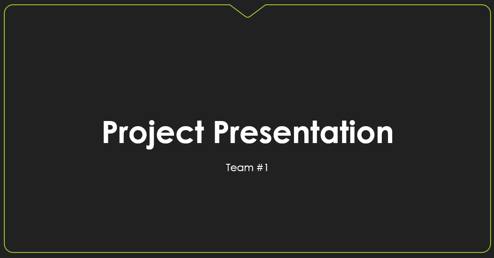

# Human Computer Interaction project repository

## 📝 About the project

This project is aiming to fight, or at least reducing, the negative effects on people’s mental health that social isolation has caused during the COVID-19 pandemic, such as stress, anxiety, sadness, among others.

The project consists of developing a mobile application that simulates using a diary, with the option of reproducing music, sharing your thoughts with other people, and having special interactions with the written pages, all for letting and helping people to express their feelings and finally relive their burdens.

It is important to clarify that the proposal is a complementary activity that is not replacing a professional therapy or counseling service.

> [📚 Go to the documentation section.](./github/doc/index.md)

## 👨‍💻 Team organization

|                      Team Member                      |                    Team Member                     |                    Team Member                     |                     Team Member                      |                    Team Leader                     |
| :---------------------------------------------------: | :------------------------------------------------: | :------------------------------------------------: | :--------------------------------------------------: | :------------------------------------------------: |
|  |  |  |  |  |
|    [Alejandro Cauich](https://github.com/Alrox97)     |   [Amaury Morales](https://github.com/amcamcamc)   |   [Carlos Kuk](https://github.com/carlosbaeza6)    |   [Jonathan Gómez](https://github.com/JonathanGGB)   |    [Joshua Meza](https://github.com/JoshuaMeza)    |

## 🏫 College information

### University

Facultad de Matemáticas, Universidad Autónoma de Yucatán.

### Career

Bachelor of Software Engineering.

### Professor

Dr. Edgar Cambranes Martínez.
