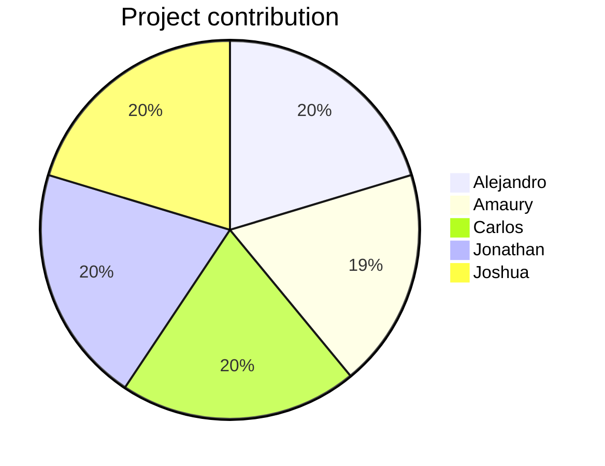

# 📅 Organization

## Table of contents

- [Activities schedule](#activities-schedule)
- [Work metric](#work-metric)

## Activities schedule

|   #    | Activity                                               |     Responsibles     | Start date  |  End date   | Resulting artifact                                  |
| :----: | :----------------------------------------------------- | :------------------: | :---------: | :---------: | :-------------------------------------------------- |
| **1**  | Project ideas definition                               |       Everyone       | January 23  | January 27  | Project ideas presentation                          |
| **2**  | Repository development - First iteration               |       Everyone       | January 23  |  March 20   | Repository and introduction video v1                |
| **3**  | First acceptance meeting                               |       Everyone       | February 9  | February 9  | Ideas feedback                                      |
| **4**  | Idea selection and deeper definition                   |       Everyone       | February 9  | February 11 | Project definition                                  |
| **5**  | Expert interview preparation, application and analysis |       Everyone       | February 11 | February 11 | Deeper understanding about the problematic          |
| **6**  | Second acceptance meeting                              |       Everyone       | February 11 | February 11 | Project idea acceptance and feedback                |
| **7**  | Project's elevator speech elaboration                  |       Everyone       | February 11 | February 14 | Elevator speech presentation and solution proposals |
| **8**  | Personas definition                                    |       Everyone       | February 16 | February 22 | Personas definition presentation                    |
| **9**  | Survey preparation and application                     |       Everyone       | February 28 |  March 12   | Data collection                                     |
| **10** | Gender HCI research                                    |       Everyone       |   March 9   |  March 14   | Project evaluation and Gender HCI video             |
| **11** | Progress control meeting                               |       Everyone       |  March 11   |  March 11   | Progress validation                                 |
| **12** | Survey's result analysis                               |        Amaury        |  March 12   |  March 18   | Personas and scenarios definition                   |
| **13** | User requirements definition                           | Alejandro and Carlos |  March 13   |  March 18   | User requirements                                   |
| **14** | Project overview                                       | Jonathan and Joshua  |  March 15   |  March 20   | Introduction video v2                               |
| **15** | Progress control meeting                               |       Everyone       |  March 25   |  March 25   | Progress validation                                 |
| **16** | Feedback formal analysis                               |       Everyone       |  March 27   |     ---     | Feedback analysis presentation                      |
| **17** | Repository development - Second iteration              |       Everyone       |  March 28   |  11 April   | Repository                                          |
| **18** | Design process definition                              |       Everyone       |  March 28   |  March 31   | Design process presentation                         |
| **19** | Prototype design                                       |       Everyone       |   April 1   |   April 8   | Prototype                                           |
| **20** | Project overview                                       |       Everyone       |   April 6   |   April 8   | Introduction video v3                               |
| **21** | Progress control meeting                               |       Everyone       |   April 8   |   April 8   | Progress validation                                 |
| **22** | Repository development - Third iteration               |       Everyone       |  April 26   |     ---     | Repository                                          |
| **23** | Progress control meeting                               |       Everyone       |  April 29   |  April 29   | Progress validation                                 |

## Work metric

Depending on the complexity of each task, the members can earn a fixed amount of points for each activity they have worked on. At the end, the measurement is done by comparing how much has everyone accumulated compared to the others.

| Activity | Complexity | Alejandro | Amaury | Carlos | Jonathan | Joshua |
| :------: | :--------: | :-------: | :----: | :----: | :------: | :----: |
|  **1**   |   **2**    |     2     |   2    |   2    |    2     |   2    |
|  **2**   |   **3**    |     3     |   3    |   3    |    3     |   3    |
|  **3**   |   **1**    |     1     |   1    |   1    |    1     |   1    |
|  **4**   |   **2**    |     2     |   2    |   2    |    2     |   2    |
|  **5**   |   **3**    |     3     |   3    |   3    |    3     |   3    |
|  **6**   |   **1**    |     1     |   1    |   1    |    1     |   1    |
|  **7**   |   **3**    |     3     |   3    |   3    |    3     |   3    |
|  **8**   |   **2**    |     2     |   2    |   2    |    2     |   2    |
|  **9**   |   **2**    |     2     |   2    |   2    |    2     |   2    |
|  **10**  |   **2**    |     2     |   0    |   2    |    2     |   2    |
|  **11**  |   **1**    |     1     |   0    |   1    |    1     |   1    |
|  **12**  |   **3**    |     0     |   3    |   0    |    0     |   0    |
|  **13**  |   **2**    |     2     |   0    |   2    |    0     |   0    |
|  **14**  |   **2**    |     0     |   0    |   0    |    2     |   2    |
|  **15**  |   **1**    |     1     |   1    |   1    |    1     |   1    |
|  **16**  |   **2**    |     -     |   -    |   -    |    -     |   -    |
|  **17**  |   **3**    |     -     |   -    |   -    |    -     |   -    |
|  **18**  |   **2**    |     -     |   -    |   -    |    -     |   -    |
|  **19**  |   **3**    |     -     |   -    |   -    |    -     |   -    |
|  **20**  |   **2**    |     -     |   -    |   -    |    -     |   -    |
|  **21**  |   **1**    |     -     |   -    |   -    |    -     |   -    |
|  **22**  |   **3**    |     -     |   -    |   -    |    -     |   -    |
|  **23**  |   **1**    |     -     |   -    |   -    |    -     |   -    |
|          | **Total**  |    25     |   23   |   25   |    25    |   25   |

> [👈 Go back.](./index.md)
