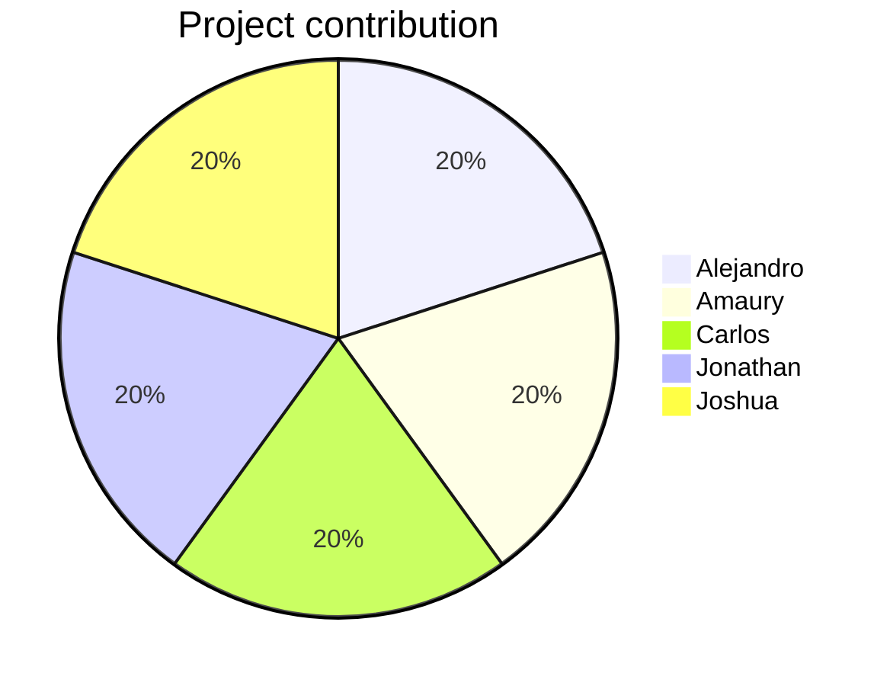

# 📅 Organization

## Table of contents

- [Activities schedule](#activities-schedule)
- [Work metric](#work-metric)

## Activities schedule

|   #   | Activity                                               | Responsibles | Start date  |  End date   | Resulting artifact                         |
| :---: | :----------------------------------------------------- | :----------: | :---------: | :---------: | :----------------------------------------- |
| **1** | Project ideas definition                               |     All      | January 23  | January 27  | Project ideas presentation                 |
| **2** | Repository development - First iteration               |     All      | January 23  |   March 4   | Repository                                 |
| **3** | First acceptance meeting                               |     All      | February 9  | February 9  | Ideas feedback                             |
| **4** | Idea selection and deeper definition                   |     All      | February 9  | February 11 | Project definition                         |
| **5** | Expert interview preparation, application and analysis |     All      | February 11 | February 11 | Deeper understanding about the problematic |
| **6** | Second acceptance meeting                              |     All      | February 11 | February 11 | Project idea acceptance and feedback       |
| **7** | Project's elevator speech elaboration                  |     All      | February 11 | February 14 | Elevator speech presentation               |
| **8** | Personas definition                                    |     All      | February 16 | February 22 | Personas definition presentation           |
| **9** | Survey preparation, application and analysis           |     All      | February 28 |   March 4   | Personas complete definition               |

## Work metric

Depending on the complexity of each task, the members can earn a fixed amount of points for each activity they have worked on. At the end, the measurement is done by comparing how much has everyone accumulated compared to the others.

| Activity | Complexity | Alejandro | Amaury | Carlos | Jonathan | Joshua |
| :------: | :--------: | :-------: | :----: | :----: | :------: | :----: |
|  **1**   |     2      |     2     |   2    |   2    |    2     |   2    |
|  **2**   |     3      |     3     |   3    |   3    |    3     |   3    |
|  **3**   |     1      |     1     |   1    |   1    |    1     |   1    |
|  **4**   |     2      |     2     |   2    |   2    |    2     |   2    |
|  **5**   |     3      |     3     |   3    |   3    |    3     |   3    |
|  **6**   |     1      |     1     |   1    |   1    |    1     |   1    |
|  **7**   |     2      |     2     |   2    |   2    |    2     |   2    |
|  **8**   |     2      |     2     |   2    |   2    |    2     |   2    |
|  **9**   |     3      |     3     |   3    |   3    |    3     |   3    |
|          | **Total**  |    19     |   19   |   19   |    19    |   19   |

> [👈 Go back.](./index.md)
