# Design solutions

## Table of contents

- [Transforming requirements to UI](#transforming-requirements-to-ui)
  - [Introduction](#introduction)
  - [Deriving Concrete Requirements from Essential Requirements](#deriving-concrete-requirements-from-essential-requirements)
  - [Identifying Task Objects, Attributes, and Actions](#identifying-task-objects-attributes-and-actions)
    - [Task Objects](#task-objects)
    - [Attributes](#attributes)
    - [Actions](#actions)
  - [Marking Up the Concrete Requirements to Identify Task Objects, Their Attributes, and Actions](#marking-up-the-concrete-requirements-to-identify-task-objects-their-attributes-and-actions)
  - [Prototyping Task Objects, Attributes, and Actions](#prototyping-task-objects-attributes-and-actions)
  - [Creating the content diagram](#creating-the-content-diagram)
  - [Guidelines for a low fidelity user interface](#guidelines-for-a-low-fidelity-user-interface)
- [Project application](#project-application)
  - [Structure prototype](#structure-prototype)
    - [Use case 1: Selection of Activities](#use-case-1-selection-of-activities)
    - [Use case 2: Mental Health Care Information](#use-case-2-mental-health-care-information)
    - [Use case 3: Security and Privacy](#use-case-3-security-and-privacy)
    - [Final content diagram](#final-content-diagram)
    - [Interaction design](#interaction-design)
  - [User interface](#user-interface)
    - [Low fidelity](#low-fidelity)
    - [Mid fidelity](#mid-fidelity)
    - [Usability test](#usability-test)

## Transforming requirements to UI

### Introduction

For this task, a design process known as Conceptual Design described in the book User Interface Design and Evaluation (Jarret, Minocha, Stone & Woodroffe, 2005, pp. 144-164) was applied, it consists of doing four main tasks to develop a low fidelity prototype, called content diagram, that represents the organization and structure of the user interface from a designer’s perspective. The activities are the following:

1. Derive the concrete use cases from the essential use cases.
2. Identify the primary task objects, attributes, and actions.
3. Identify the different containers and the task objects that go into each one.
4. Link the containers to show the navigation flow.

In the next sections you will see the complete process for this strategy (that is a summary of the book), but you can also check a [presentation](https://alumnosuady-my.sharepoint.com/:p:/g/personal/a16001575_alumnos_uady_mx/ESMxwAdWWfFFh95xA3KL0oMBt4aHz71UgKOVQyoew-J3Hg?e=HJ72DP) made by the team that goes step by step implementing the entire procedure.

### Deriving Concrete Requirements from Essential Requirements

Create a table, on one side is the requirement and its counterpart has the output or the behavior of the system based on said requirement, for example:

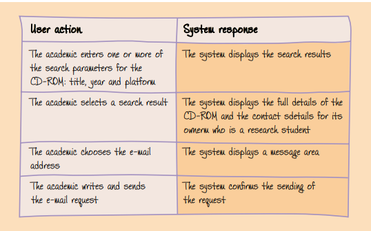

### Identifying Task Objects, Attributes, and Actions

The next step is to identify the task objects, their attributes, and the actions the user will perform on them. These details will influence what goes into each of the containers in the content diagram and the links needed between the containers.

#### Task Objects

Primary task objects are the units of information or data with which the users interact to carry out their tasks. They are high-level objects, central to the tasks the users will be carrying out. Typically, there are only a few primary task objects, and they are easy to identify. For example, if you were designing a UI for a hotel registration system, there would probably be only two primary task objects: one corresponding to the customer, the other to the room.
These task objects will typically be translated onto your UI design as combinations of user interface objects, such as screens, windows, dialog boxes, pull-down menus, icons, combo boxes, and so on. In embedded systems, such as mobile telephones, these may take the form of physical buttons and other simple input devices, plus output on the screen.

#### Attributes

A task object must have attributes. If a task object does not have any attributes, it is not an object but rather the attribute of another task object. For example, for the hotel registration system the number of people who can occupy a hotel room is an attribute of the room object rather than an object. There are two kinds of attributes:

- **Properties**. For example, in the digital library title and author are properties of the book task object.
- **Child objects**. These are task objects. For example, an attribute could indicate who owns a CD-ROM. The owner could be an academic, making the academic task object a child object of the CD-ROM task object. It is a task object because it has its own attributes, such as the name of the academic, his e-mail address, and so on.

This relation can influence the design process, as visual containment results when an attribute is a child object. In user interface design, this means that when the task object is displayed on a screen, the child object will also be displayed on the same screen.

#### Actions

When users carry out their tasks, they perform various actions on the task objects. For example, in the hotel registration system, the receptionist will want to allocate guests to rooms.
This means the room task object will need to have a corresponding allocation action. You can identify these actions by reviewing the concrete requirements. In addition, you should consider standard actions such as view, create, delete, copy, save, edit, and print.

### Marking Up the Concrete Requirements to Identify Task Objects, Their Attributes, and Actions

- Single-underline nouns that you think may correspond to task objects.
- Double underline the attributes of these task objects.
  Verbs often correspond to actions. We do not suggest marking these up as the relationships are often less direct. However, identifying the verbs can still be useful.

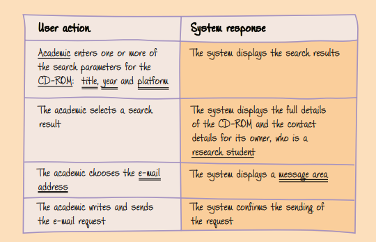

You can see from the markup that we have identified the academic, research student, and CD-ROM task objects. In addition, by implication we have identified e-mail, a further task object. This is not mentioned explicitly, but two of its attributes are email address and message area. We have also identified the title, year, and platform attributes of the CD-ROM task object.
Once you have identified the task objects and attributes, it is helpful to compile them, along with the actions, into a single object–action–attribute table.
The actions are the standard actions, plus the reserve action, which allows the member to indicate that the CD-ROM has been reserved. You should note that the actions relate to the CD-ROM details in the digital library system, rather than to the CD-ROM itself. Thus, the table indicates that it is possible to edit these details, but it does not say it is possible to alter the CD-ROM itself.

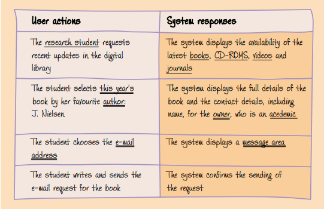

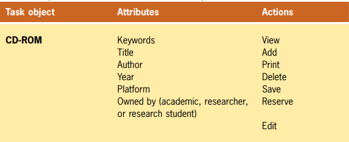

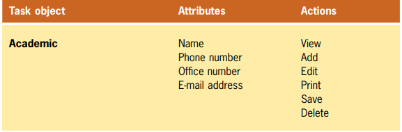

### Prototyping Task Objects, Attributes, and Actions

Before continuing, it is important to notice that some of the task objects, attributes, and their actions may not necessarily come from the concrete use cases but rather from the users’ knowledge of the domain or from your own domain analysis, so the best approach is to prototype your ideas, working alongside potential users of the system.
That said, one way is using sticky notes. Write a one-sentence definition of the task object on one sticky note, the task object’s properties on another, the actions that can be applied to it on a third, and divide a fourth note into two columns, one that is headed with “I’m in” and the other one with “In me”, and write there any parent and child objects, respectively, that are related to this task object. Once done, place them together.

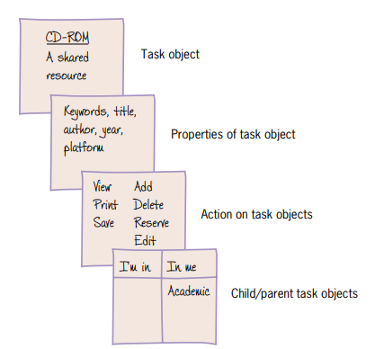

### Creating the content diagram

The next step is to identify the containers that are needed for the content diagram. Each container collects functions and task objects into a coherent place in the system to support a part of the user’s work. Typically, these become screens, windows, dialog boxes, or message boxes in the UI. We also need to identify the links between the containers, that indicate the navigation around the user interface.

The first container we need to specify is the main container. This represents the first thing the users encounter and will be central to their work, so the parts that must be there include:

- **Vital tasks**: The user must perform these tasks quickly, even under stress.
- **Frequent tasks**: Those tasks that users spend most of their time performing must be fast to access.
- **Navigation aids**: The users need to understand quickly and easily what the application can do and how to accomplish their tasks.

Typically, the section of the UI corresponding to the main container will not perform any of these tasks, instead, it will provide links to the containers that do. Other containers are usually derived from the concrete use cases, in which each of them shows the sequence of steps needed to accomplish a particular task, and every functionality that makes possible accomplishing that task can be divided into one or more containers.
Finally, once we have identified the containers, we need to link them together to reflect the navigation flow (according to the concrete use cases). If any conditions determine the navigation flow to a particular container, label the arrow.

|     Defining containers and linking      |         Generating content diagram          |            User interface proposal            |
| :--------------------------------------: | :-----------------------------------------: | :-------------------------------------------: |
| 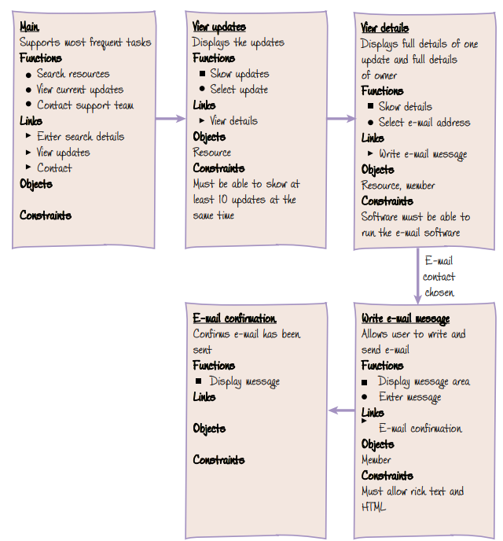 | 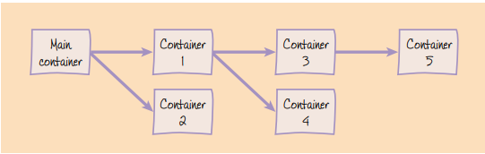 | 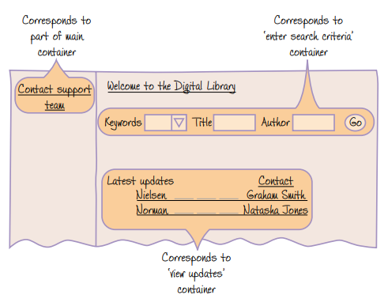 |

The template used for defining containers is the next one:

| **Name**                        | Container’s name                                                                                                                                                                                                                                                                                                                                                                                                                                                                           |
| :------------------------------ | :----------------------------------------------------------------------------------------------------------------------------------------------------------------------------------------------------------------------------------------------------------------------------------------------------------------------------------------------------------------------------------------------------------------------------------------------------------------------------------------- |
| **Purpose**                     | A phrase indicating its purpose in supporting the user’s task.                                                                                                                                                                                                                                                                                                                                                                                                                             |
| **Functions**                   | - Functions invoked by the user.   - Functions invoked automatically by the system.                                                                                                                                                                                                                                                                                                                                                                                                     |
| **Links**                       | The links with other containers, indicating the name of the container linked to and its purpose. There are two types of links:   **Single links**: A single link indicates that the user moves to another container and then that new container becomes the focus of the user’s activities.   **Double links**: A double link indicates that the work done in a second container needs the context of the first container and that the user will switch back and forth between both. |
| **Objects**                     | The task objects whose attributes and actions are required for the users to complete their tasks.                                                                                                                                                                                                                                                                                                                                                                                          |
| **Non-functional requirements** | Any constraints of the container.                                                                                                                                                                                                                                                                                                                                                                                                                                                          |

### Guidelines for a low fidelity user interface

In the case of designing user interfaces, you probably would like to use a standard style that could make the user feel more comfortable while using your solution. You can try the following guidelines if you want:

- [Style guides.](https://www.mockplus.com/blog/post/ui-style-guide)
- [Layouts.](https://xd.adobe.com/ideas/principles/web-design/11-website-layouts-that-made-content-shine-in-2019/)
- [Icons.](https://www.redhat.com/en/about/brand/standards/icons/standard-icons)

## Project application

### Structure prototype

#### Use case 1: Selection of Activities

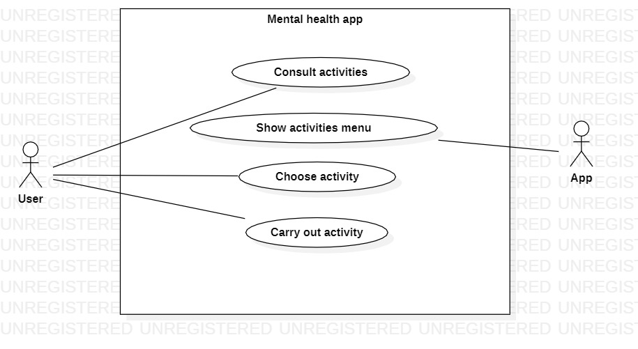

As we know, we start by marking up the concrete requirements to identify task objects, their attributes, and their actions.

| User action                                                                                        | System response                                                                                               |
| -------------------------------------------------------------------------------------------------- | ------------------------------------------------------------------------------------------------------------- |
| The user enters the application to perform an **activity** and goes to the **activities section**. | The system displays the available activities to be carried out.                                               |
| The user selects an activity that catches their attention.                                         | The system displays the activity selected by the user and **provides you with various tools** for you to use. |
| The user performs a job using the app's tools.                                                     | The system **saves the work**, so that the user can **consult it** at another time.                           |

Then, it is helpful to compile them, along with the actions, into a single object–action–attribute table.

| User action                                                                       | System response                                                                             |
| --------------------------------------------------------------------------------- | ------------------------------------------------------------------------------------------- |
| The user **consults** the **activities** available in the **activities section**. | The system shows the activities that can be performed in the app.                           |
| The user selects the **journal** activity.                                        | The system displays a canvas with **tools to write, delete, change font type, color, etc**. |
| The user writes on the canvas customizing it in their own way.                    | The system **saves the work**, so that the user can **consult it** at another time.         |

After that, to increase readability, it is good to organize the information in an object–attribute–action table.

| Task object  |    Attributes    |     Actions     |
| :----------: | :--------------: | :-------------: |
| **Activity** |      Title       | View   Edit  |
|              |     Content      | Edit   Save  |
|              | Number of sheets | Add   Remove |
|              |      Format      |      Edit       |

The next step is to prototype the containers.

| **Name**                        | Main                                                              |
| ------------------------------- | ----------------------------------------------------------------- |
| **Purpose**                     | Support for app activities                                        |
| **Functions**                   | - Access to the draw activity   - Access to the diary activity |
| **Links**                       | - Diary   - Draw                                               |
| **Objects**                     |                                                                   |
| **Non-functional requirements** | NFR1, NFR6, NFR14, NFR15, NFR16                                   |

| **Name**                        | Draw activity                                                  |
| ------------------------------- | -------------------------------------------------------------- |
| **Purpose**                     | The user can draw inside the canvas in the application         |
| **Functions**                   | - Draw   - Paint   - Change the stroke style   - Save |
| **Links**                       | - Save activity                                                |
| **Objects**                     | Document                                                       |
| **Non-functional requirements** | NFR1, NFR6, NFR13, NFR14, NFR15, NFR16                         |

| **Name**                        | Diary activity                                                 |
| ------------------------------- | -------------------------------------------------------------- |
| **Purpose**                     | The user can draw inside the canvas in the application         |
| **Functions**                   | - Write   - Edit text   - Save   - Change text format |
| **Links**                       | - Save activity                                                |
| **Objects**                     | Document                                                       |
| **Non-functional requirements** | NFR1, NFR6, NFR13, NFR14, NFR15, NFR16                         |

| **Name**                        | Save activity                    |
| ------------------------------- | -------------------------------- |
| **Purpose**                     | Save the progress of an activity |
| **Functions**                   | - Save                           |
| **Links**                       |                                  |
| **Objects**                     | Encrypted document               |
| **Non-functional requirements** | NFR1, NFR3, NFR15, NFR17         |

Finally, it is time to build the content diagram.

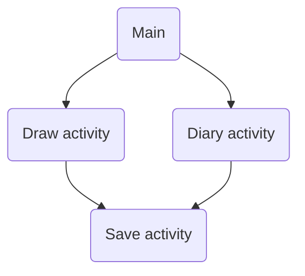

#### Use case 2: Mental Health Care Information

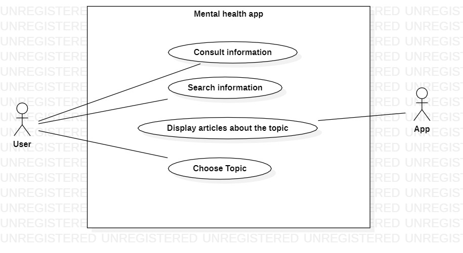

As we know, we start by marking up the concrete requirements to identify task objects, their attributes, and their actions.

| User action                                                                                                                              | System response                                                                                                               |
| ---------------------------------------------------------------------------------------------------------------------------------------- | ----------------------------------------------------------------------------------------------------------------------------- |
| The user enters the application to **investigate** or learn more about a topic on mental health and goes to the **information section**. | The system displays the list of mental health topics available to browse.                                                     |
| The user **selects the topic** that catches his attention.                                                                               | The system **displays the information of the topic** selected by the user and lets him browse the rest of the available ones. |
| The user has the option to **filter** the information section for specific topics they want to **investigate**.                          | The system display the topics the user has filtered, giving the option for selecting an article.                              |

Then, it is helpful to compile them, along with the actions, into a single object–action–attribute table.

| User action                                                                            | System response                                                                                                                                                                     |
| -------------------------------------------------------------------------------------- | ----------------------------------------------------------------------------------------------------------------------------------------------------------------------------------- |
| The user **consults or searches the topics** available in the **information section**. | The system displays the list of mental health topics available to browse.                                                                                                           |
| The user **selects the topic** that catches his attention.                             | The system displays the information of the topic selected by the user, this includes the **title**, the **date** of publication, the **content** and the associated **multimedia**. |
| The user **filters the topics** they want to investigate.                              | The system displays different topics on the filter related to what the user is looking for, usually the content or associated multimedia is the information presented.              |

After that, to increase readability, it is good to organize the information in an object–attribute–action table.

| Task object | Attributes | Actions |
| :---------: | :--------: | :-----: |
|  **Topic**  |   Title    |  View   |
|             |    Date    |  View   |
|             |  Content   |  View   |
|             | Multimedia |  View   |

The next step is to prototype the containers.

| **Name**                        | Main                                         |
| ------------------------------- | -------------------------------------------- |
| **Purpose**                     | Support for information section              |
| **Functions**                   | - Search article   - Consult all articles |
| **Links**                       | - Search article   - Consult all articles |
| **Objects**                     |                                              |
| **Non-functional requirements** | NFR2, NFR6, NFR8, NFR13                      |

| **Name**                        | Search article                             |
| ------------------------------- | ------------------------------------------ |
| **Purpose**                     | The user can search for an article         |
| **Functions**                   | - Display articles   - Open article     |
| **Links**                       | - Consult all articles   - View article |
| **Objects**                     | Articles                                   |
| **Non-functional requirements** | NFR4                                       |

| **Name**                        | Consult all articles                                                                   |
| ------------------------------- | -------------------------------------------------------------------------------------- |
| **Purpose**                     | The user can consult all the information available on mental health in the application |
| **Functions**                   | - Search article   - Open article                                                   |
| **Links**                       | - Search article   - View article                                                   |
| **Objects**                     | Articles                                                                               |
| **Non-functional requirements** | NFR2, NFR4                                                                             |

| **Name**                        | View article                            |
| ------------------------------- | --------------------------------------- |
| **Purpose**                     | The user can open an article to read it |
| **Functions**                   | - Read article                          |
| **Links**                       |                                         |
| **Objects**                     | Article                                 |
| **Non-functional requirements** | NFR2, NFR14                             |

Finally, it is time to build the content diagram.

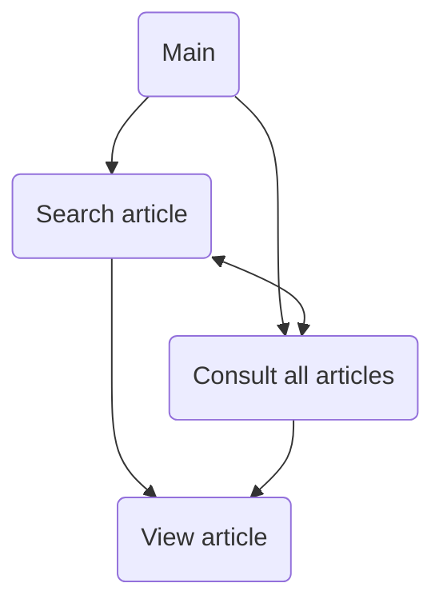

#### Use case 3: Security and Privacy

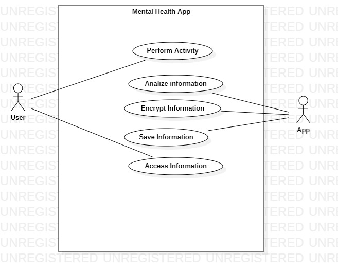

As we know, we start by marking up the concrete requirements to identify task objects, their attributes, and their actions.

| User action                                                               | System response                                                                                                                            |
| ------------------------------------------------------------------------- | ------------------------------------------------------------------------------------------------------------------------------------------ |
| The user **perform** an activity available in the **activities section**. | The system **analize and encrypt** the activity performed by the user.                                                                     |
| The user can **check** their previously done activities.                  | The system shows the **activity’s information** that was saved.                                                                            |
| The user can **edit** their previously done activities.                   | The system shows the activity information saved previously and allows the user to **update**, **edit** or **erase** information from them. |

Then, it is helpful to compile them, along with the actions, into a single object–action–attribute table.

| User action                                                               | System response                                                                                                                                                                |
| ------------------------------------------------------------------------- | ------------------------------------------------------------------------------------------------------------------------------------------------------------------------------ |
| The user **perform** an activity available in the **activities section**. | The system **analize, encrypt and save** the activity that was performed by the user in a database. Also **shows a tutorial** if it is their first time using the application. |
| The user can **check and edit** their previously done activities.         | The system shows the **activity’s information** that was saved.                                                                                                                |

After that, to increase readability, it is good to organize the information in an object–attribute–action table.

| Task object  |    Attributes    |     Actions     |
| :----------: | :--------------: | :-------------: |
| **Activity** |      Title       | View   Edit  |
|              |     Content      | Edit   Save  |
|              | Number of sheets | Add   Remove |
|              |      Format      |      Edit       |

The next step is to prototype the containers.

| **Name**                        | Main                                      |
| ------------------------------- | ----------------------------------------- |
| **Purpose**                     | Support fot activity information          |
| **Functions**                   | - Perform activity   - Access activity |
| **Links**                       | - Perform activity   - Access activity |
| **Objects**                     |                                           |
| **Non-functional requirements** | NFR1, NFR3, NFR6, NFR10, NFR11            |

| **Name**                        | Perform activity                                       |
| ------------------------------- | ------------------------------------------------------ |
| **Purpose**                     | The user performs an activity by creating a new record |
| **Functions**                   |                                                        |
| **Links**                       |                                                        |
| **Objects**                     | Activity                                               |
| **Non-functional requirements** | NFR3, NFR13, NFR17                                     |

| **Name**                        | Access activity                 |
| ------------------------------- | ------------------------------- |
| **Purpose**                     | The user checks an old activity |
| **Functions**                   | - Edit activity                 |
| **Links**                       | - Edit activity                 |
| **Objects**                     | Activity                        |
| **Non-functional requirements** | NFR5, NFR7                      |

| **Name**                        | Edit activity                       |
| ------------------------------- | ----------------------------------- |
| **Purpose**                     | The user can edit ther old activity |
| **Functions**                   | - Edit   - Save                  |
| **Links**                       | - Save                              |
| **Objects**                     | Activity                            |
| **Non-functional requirements** | NFR5, NFR7, NFR3                    |

| **Name**                        | Save activity                    |
| ------------------------------- | -------------------------------- |
| **Purpose**                     | Save the progress of an activity |
| **Functions**                   | - Save                           |
| **Links**                       |                                  |
| **Objects**                     | Encrypted document               |
| **Non-functional requirements** | NFR1, NFR3, NFR15, NFR17         |

Finally, it is time to build the content diagram.

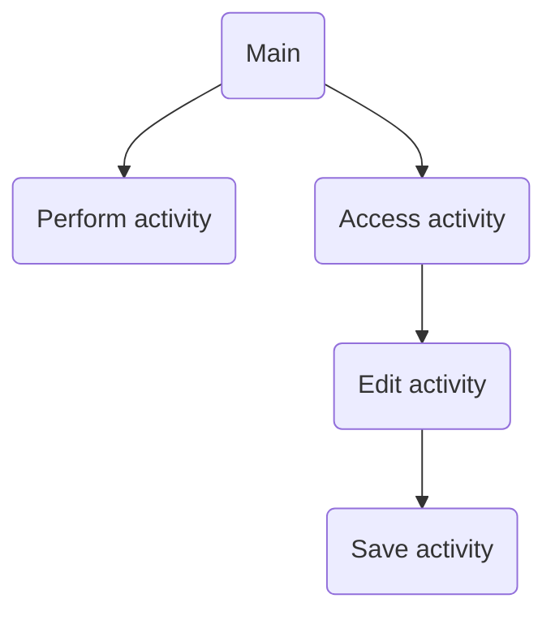

#### Final content diagram

After doing the same process for every existing requirement and joining every individual content diagram, we can get something like this:

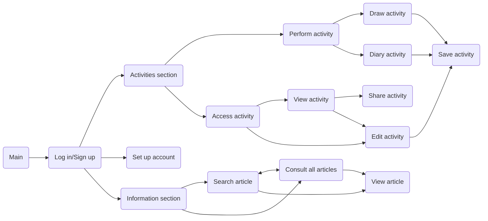

#### Interaction design

The users are planned to use the application in the following way:

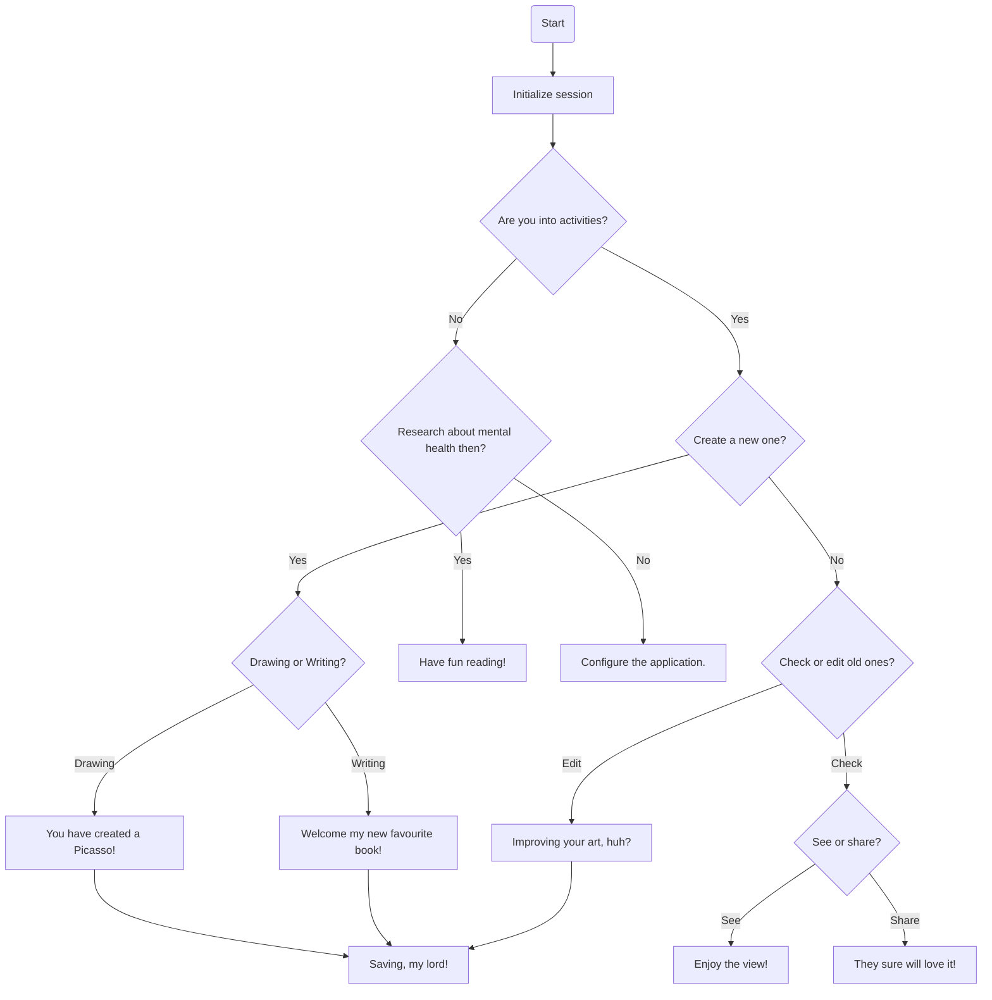

### User interface

#### Low fidelity

...

#### Mid fidelity

...

#### Usability test

... (Bosquejo de Prueba de Usabilidad de la rubrica)

> [👈 Go back.](../specs.md)
