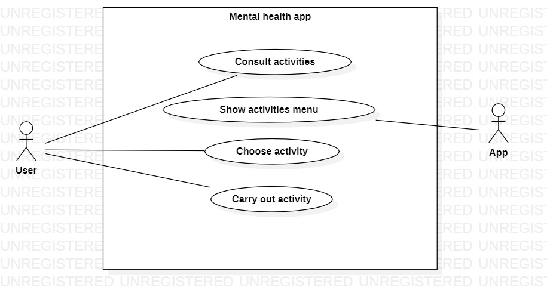
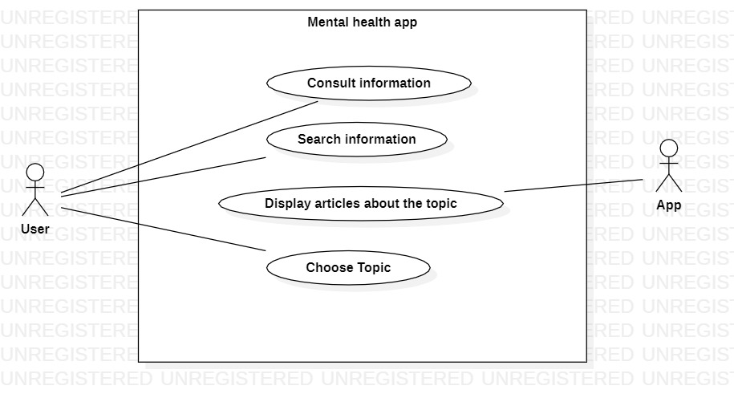
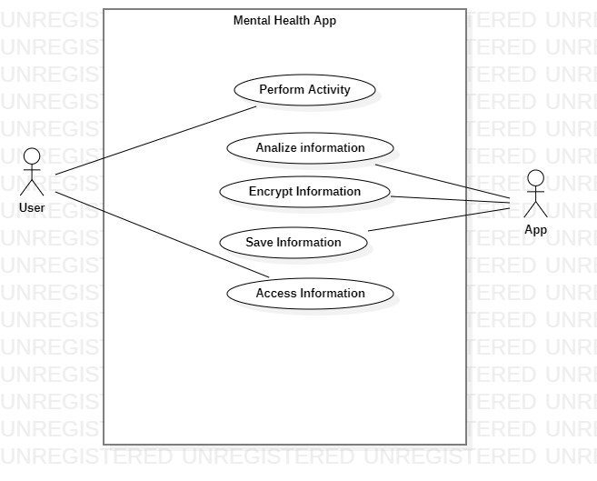

# Specify user requirements

## Table of contents

- [Requirements definition](#requirements-definition)
  - [Functional](#functional)
  - [Non-functional](#non-functional)
  - [Use case diagrams](#use-case-diagrams)
    - [Use case 1](#use-case-1)
    - [Use case 2](#use-case-2)
    - [Use case 3](#use-case-3)

## Requirements definition

### Functional

- **FR1**: The system provides the user with activities that help reduce their stress level.
- **FR2**: The system provides advice for taking a better care of mental health.
- **FR3**: The system provides information about the relationship between having a healthy diet and keeping a good mental health.
- **FR4**: The system will mention that it is not a substitute of profesional consultory or psychological therapy.
- **FR5**: The system will have an activity that allows the user to write about their experiences or emotions.
- **FR6**: The system will allow the user to make drawings in their annotations.
- **FR7**: The system will have a community section where users can share their work or experiences.
- **FR8**: The system must provide the user with notifications of new updates, activities and mental health information.
- **FR9**: The system must control access, only allowing it to authorized users.
- **FR10**: The system will have relaxing music in the background.

### Non-functional

- **NFR1**: The time of response on any of the functionalities on the application, excluding a saving process, should not take more than 1 second.
- **NFR2**: The information provided should only be from psychological organizations or experts of the field.
- **NFR3**: The information entered by users in the application must be completely confidential.
- **NFR4**: The information entered by users must always be encrypted, to guarantee their privacy and security.
- **NFR5**: Only the user can access to their recorded experiences.
- **NFR6**: People must be able to understand how to use the application by intuition, they are not supposed to spend more tan 20 seconds to find where to access to any of the most representative features, starting in the principal menu, during their first-time use.
- **NFR7**: The application should have a size smaller than 100 MB.
- **NFR8**: Any song provided by the application must be accepted for use by a professional.

### Use case diagrams

#### Use case 1

|                     | Selection of Activities                                                                                        |
| :-----------------: | :------------------------------------------------------------------------------------------------------------- |
|  **Dependencies**   | RF5: Annotations about user experiences or emotions                                                            |
|                     | RF6: History of activities carried out                                                                         |
|                     | RF7: Share content                                                                                             |
|  **Precondition**   | The user has entered the system through his username and password and has decided to perform an activity.      |
|   **Description**   | The system will provide the user a set of activities that they can choose to de-stress or distract themselves. |
| **Normal Sequence** | **Action**                                                                                                     |
|        **1**        | The system displays the activities that are available                                                          |
|        **2**        | The system displays a brief description of the activity                                                        |
|        **3**        | The user confirms the activity to be performed                                                                 |
|        **4**        | The system loads the activity                                                                                  |
|        **5**        | The user can now interact with the elements of the activity                                                    |
|  **Postcondition**  | The user performs the selected activity, and the system saves the progress of the activity.                    |

#### Use case 2

|                     | Mental Health Care Information                                                                      |
| :-----------------: | :-------------------------------------------------------------------------------------------------- |
|  **Dependencies**   | RF4: Reminder that the app does not replace traditional therapy                                     |
|                     | RF7: Share content                                                                                  |
|  **Precondition**   | The user has has been authenticated and wants to consult information about mental health.           |
|   **Description**   | The system will provide different tips, notes or information related to the topic of mental health. |
| **Normal Sequence** | **Action**                                                                                          |
|        **1**        | The system displays a menu of options                                                               |
|        **2**        | The user goes to the information section                                                            |
|        **3**        | The user selects the note that attracts the most attention                                          |
|        **4**        | The system loads the selected item                                                                  |
|  **Postcondition**  | The user can now read the selected information.                                                     |

#### Use case 3

|                     | Security & Privacy                                                                                       |
| :-----------------: | :------------------------------------------------------------------------------------------------------- |
|  **Dependencies**   | RNF1: Information entered by users must be confidential                                                  |
|                     | RNF4: Information must be encrypted                                                                      |
|                     | RNF5: Only the user can access their recorded experiences                                                |
|                     | RF9: The system can be accessed by authorized users                                                      |
|  **Precondition**   | The user has performed multiple activities on the system, placing experiences and sensitive information. |
|   **Description**   | The system will save the information in a database, that only the user can retrieve.                     |
| **Normal Sequence** | **Action**                                                                                               |
|        **1**        | The user performs some of the activities                                                                 |
|        **2**        | The system analyzes the information entered by the user                                                  |
|        **3**        | The system encrypts the information                                                                      |
|        **4**        | The system saves the information in a database                                                           |
|        **5**        | The user accesses this information only if he enters his username and password                           |
|  **Postcondition**  | The user can consult the annotations they had made without the concern that their data can be exposed.   |

> [👈 Go back.](../specs.md)
